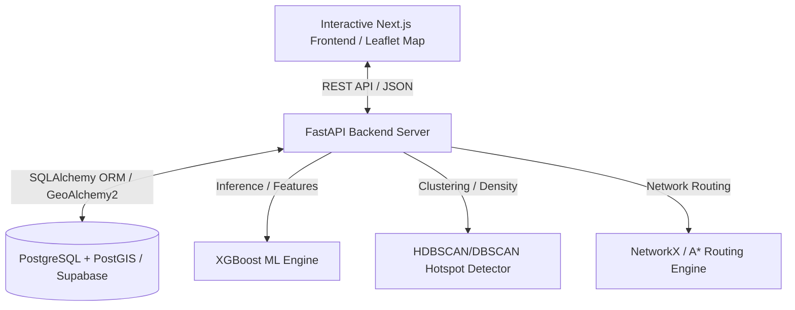

# 🚦 EventPulse AI

### **AI-Powered Event-Driven Traffic Intelligence Platform**

EventPulse AI is a state-of-the-art smart city solution designed to forecast, analyze, and mitigate traffic congestion caused by major public events (concerts, sports, festivals, protests, construction, and accidents). Using machine learning (XGBoost), geospatial clustering (DBSCAN/HDBSCAN), and interactive map visualization, it enables city planning and transit authorities to dynamically reroute traffic, allocate resources, and run what-if simulation scenarios in real-time.

---

## 🗺️ Table of Contents
1. [Key Features](#-key-features)
2. [Tech Stack & System Architecture](#-tech-stack--system-architecture)
3. [Project Directory Structure](#-project-directory-structure)
4. [Database Schema (PostgreSQL + PostGIS)](#-database-schema-postgresql--postgis)
5. [Machine Learning & Geospatial Engines](#-machine-learning--geospatial-engines)
6. [Local Development Setup](#-local-development-setup)
7. [Running with Docker Compose](#-running-with-docker-compose)
8. [Production Deployment (Kubernetes & Terraform)](#-production-deployment-kubernetes--terraform)
9. [API Endpoints Reference](#-api-endpoints-reference)

---

## 🎯 Key Features

* **Event Intelligence & Scoring**: Calculates high-precision impact and risk scores for events based on attendance, category, duration, peak hours, and location.
* **XGBoost Congestion Forecasting**: Predicts traffic speeds, delay times, and congestion percentages for affected road segments.
* **Spatial Hotspot Detection**: Groups predicted congestion points into spatial hotspots using DBSCAN and HDBSCAN algorithms, calculating radius and severity.
* **Smart Resource Allocation**: Automatically suggests marshals, police officers, and barricades needed at specific locations.
* **What-if Scenario Simulator**: Allows planners to run simulations with parameters like weather conditions, attendance multipliers, and road closures.
* **Interactive Digital Twin**: A fully-featured Next.js frontend with Leaflet maps showing real-time event markers, congestion heatmaps, and route diversion overlays.
* **Closed-Loop Feedback**: Records actual traffic outcomes post-event, calculating MAE and RMSE metrics to trigger automatic model retraining.

---

## 🏗️ Tech Stack & System Architecture



### **Backend Frameworks**
* **FastAPI**: Asynchronous Python API.
* **SQLAlchemy & GeoAlchemy2**: Database ORM with native support for spatial querying (PostGIS).
* **XGBoost & Scikit-Learn**: Machine learning training and real-time inference.
* **NetworkX**: Road network graph representation and routing calculations.
* **Geopy**: Geolocation distance metrics.

### **Frontend Frameworks**
* **Next.js 14 & React**: App Router structure with responsive UI.
* **Leaflet & React-Leaflet**: Geographic mapping and digital twin overlays.
* **Tailwind CSS**: Modern styled components and glassmorphism UI.

---

## 📁 Project Directory Structure

```text
EventPulseAI/
├── backend/                       # FastAPI Backend Application
│   ├── app/
│   │   ├── api/                   # API Routers & Dependencies
│   │   │   ├── deps.py
│   │   │   └── v1/                # events, forecast, hotspots, simulation, etc.
│   │   ├── core/                  # Database, Config & Security setup
│   │   ├── geospatial/            # DBSCAN clustering, Road Network, Routing
│   │   ├── ml/                    # Data Loader, Feature Engineering, Training/Inference
│   │   ├── models/                # SQLAlchemy Models (Event, Road, Traffic, etc.)
│   │   ├── schemas/               # Pydantic Schemas
│   │   ├── services/              # Business logic (event, forecast, hotspot, etc.)
│   │   ├── simulation/            # Scenario engine
│   │   └── main.py
│   ├── scripts/                   # Model Training & Data Export Scripts
│   ├── pyproject.toml
│   └── requirements.txt
├── frontend/                      # Next.js Frontend Application
│   ├── public/                    # Assets and Icons
│   ├── src/
│   │   ├── app/                   # Next.js Pages (Analytics, Dashboard, Simulator)
│   │   ├── components/            # UI components and Maps (DigitalTwin, HeatmapLayer)
│   │   ├── hooks/                 # Custom React Hooks
│   │   ├── lib/                   # API Client, constants, and types
│   │   └── styles/                # CSS global sheets
│   ├── tailwind.config.js
│   └── package.json
├── infrastructure/                # Orchestration & Infrastructure Code
│   ├── docker/                    # Docker Compose files (Local and Prod)
│   ├── kubernetes/                # Kubernetes Deployment Manifests
│   ├── scripts/                   # DB migrations, deployment, and seed scripts
│   └── terraform/                 # Infrastructure as Code (AWS/Azure variables)
├── README.md
└── pyrightconfig.json
```

---

## 🗄️ Database Schema (PostgreSQL + PostGIS)

EventPulse AI uses a spatial database schema. Core spatial tables include:

### **1. Events (`events`)**
Stores upcoming events and computed impact/risk metadata.
* `location`: `GEOGRAPHY(POINT, 4326)` representing longitude and latitude.
* `impact_score`: `FLOAT` (estimated congestion impact).
* `risk_score`: `FLOAT` (safety/logistics risk).

### **2. Roads (`roads`)**
Stores road network geometry.
* `geometry`: `GEOGRAPHY(LINESTRING, 4326)` representing road path coordinates.
* `capacity`: `INTEGER` (maximum vehicle flow).

### **3. Hotspots (`hotspots`)**
* `center`: `GEOGRAPHY(POINT, 4326)` representing hotspot cluster centroids.
* `severity`: `INTEGER` (range 1-5).

*Indices are constructed using **GIST** to optimize geographical query performance (e.g. `ST_DWithin` spatial checks).*

---

## 🤖 Machine Learning & Geospatial Engines

### **Congestion Forecast Engine**
The platform features an XGBoost regressor that predicts `congestion_score` (0-100%). Features are generated dynamically using `FeatureEngineer.build_feature_vector()`:
1. **Historical Traffic Profile**: Average speed, volume, and occupancy.
2. **Temporal Features**: Day of week, hour of day, and season.
3. **Event Shock Features**: Attendance log scale, event type weight, and distance to event epicenter.
4. **Road Parameters**: Total capacity, lane counts, and road class.

### **Hotspot Detector**
Uses **DBSCAN** (with precomputed geodesic distances) or **HDBSCAN** (with haversine metrics) to group predicted congestion coordinates into high-risk traffic zones.

---

## 💻 Local Development Setup

### **1. Clone the Project**
```bash
git clone https://github.com/sudip-005/EventPulse-AI.git
cd EventPulse-AI
```

### **2. Database Setup**
Connect to your local PostgreSQL instance (with PostGIS installed) or Supabase, and execute the migration/initialization script:
```bash
psql -h <host> -U <user> -d <dbname> -f infrastructure/scripts/init-db.sql
```

### **3. Backend Setup**
1. Navigate to the `backend` folder:
   ```bash
   cd backend
   ```
2. Create and activate a Python virtual environment:
   ```bash
   python -m venv .venv
   # Windows:
   .venv\Scripts\activate
   # macOS/Linux:
   source .venv/bin/activate
   ```
3. Install dependencies (updated to support Python 3.12 precompiled binary wheels on Windows):
   ```bash
   pip install -r requirements.txt
   ```
4. Create a `.env` file based on `.env.example` and set your connection strings:
   ```env
   DATABASE_URL=postgresql://<user>:<password>@<host>:<port>/<dbname>
   ```
5. Run the FastAPI development server:
   ```bash
   uvicorn app.main:app --reload
   ```

### **4. Frontend Setup**
1. Navigate to the `frontend` folder:
   ```bash
   cd ../frontend
   ```
2. Install dependencies:
   ```bash
   pnpm install
   ```
3. Set your environment variables in `.env.local` to point to the backend API.
4. Start the Next.js development server:
   ```bash
   pnpm dev
   ```

### **5. Seed Mock Data**
Run the seeding script to populate roads and historical traffic data:
```bash
python ../infrastructure/scripts/seed_data.py
```

---

## 🐳 Running with Docker Compose

To spin up the entire application stack (Next.js, FastAPI, PostgreSQL/PostGIS) locally:

```bash
cd infrastructure/docker
docker-compose up -d --build
```
* **Frontend UI**: [http://localhost:3000](http://localhost:3000)
* **Backend Docs (Swagger)**: [http://localhost:8000/docs](http://localhost:8000/docs)
* **PostgreSQL Database**: Port `5432`

---

## ☸️ Production Deployment (Kubernetes & Terraform)

### **Infrastructure Provisioning (Terraform)**
Navigate to `infrastructure/terraform` to deploy and manage resources on AWS/Azure:
```bash
cd infrastructure/terraform
terraform init
terraform plan
terraform apply
```

### **Orchestration (Kubernetes)**
Deploy the Postgres database, API services, and frontend pods:
```bash
cd ../kubernetes
kubectl apply -f postgres-statefulset.yaml
kubectl apply -f backend-deployment.yaml
kubectl apply -f backend-service.yaml
kubectl apply -f frontend-deployment.yaml
```

---

## 🔌 API Endpoints Reference

### **Events**
* `POST /api/v1/events/` - Creates an event (calculating impact/risk).
* `GET /api/v1/events/` - List all events.
* `GET /api/v1/events/{id}` - Fetch single event.

### **Traffic & Forecasts**
* `POST /api/v1/forecast/` - Generate traffic forecasts for an event.
* `GET /api/v1/forecast/event/{id}` - Get predicted forecasts for a specific event.

### **Hotspots**
* `POST /api/v1/hotspots/detect` - Run clustering (DBSCAN/HDBSCAN) to identify hotspots.
* `GET /api/v1/hotspots/event/{id}` - Fetch all detected hotspots for an event.

### **Simulations**
* `POST /api/v1/simulation/run` - Runs what-if scenarios (e.g. closures, weather).

### **Recommendations**
* `GET /api/v1/recommendations/event/{id}` - Get resource allocation recommendations.

### **Feedback & Learning**
* `POST /api/v1/learning/outcome` - Record actual post-event traffic congestion data.
* `POST /api/v1/learning/retrain` - Re-trigger XGBoost trainer with new training sets.

---

## 📄 License
This project is licensed under the MIT License - see the `LICENSE` file for details.